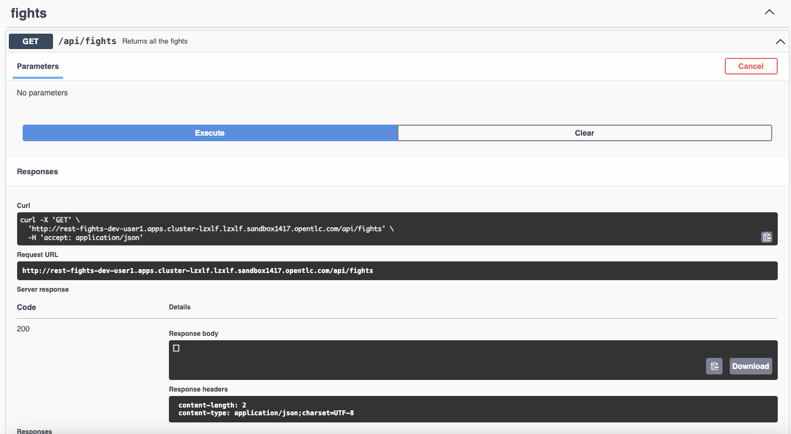
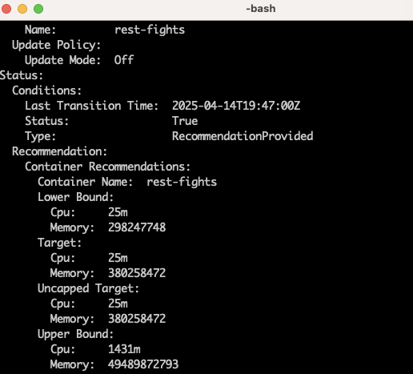

# Accelerate-Dev

## Contents

- [Intro](#intro)
- [Getting started](#getting-started)
- [Pod Budget Distribution Excercisce](#components-and-architecture)
- [Horizontal Pod Scaler Exercise](#features-and-known-limitations)
- [Network Policy](#related-links)

## Intro

This is an addition to Accelerate Application Delivery Workshop.
Users will have a chance to try: 
     Vertical Auto Scaller for assessing Deplyment resources levels
     Horizontal Auto Scaller 
     Pod Distributon Budget
     Netwrok Policy to restric access

Vertical Auto Scaller requires VPA opertor to be installed, which was done for this cluster.

## Getting Started with the vpa exercise

Clone this repo

oc login to cluster with user id assigned to you
Use dev-userX project for this exercise

oc project dev-userX ( dev-user1 for user1 )
View vpa.yaml file first, then apply it to the project.

$ oc apply -f vpa.yaml 

Next using rest-heroes Route url open it in the browser like this - http://rest-fights-dev-user1.apps.cluster-lzxlf.lzxlf.sandbox1417.opentlc.com/q/swagger-ui/
Make Sure to add q/swagger-ui/ at the end.

Run some of the APIs mutiple times. You can use run-load.sh, but first change the URL of your cluster generated URL for this API

After run $oc describe vpa rest-fights-vpa

Look for the recomdenation values captured by vpa for CPU and Memory as shown in the below image

## Pod Budget Distribution Excercisce

A Pod Disruption Budget is a Kubernetes resource that specifies the minimum number of pods that must remain available during a disruption caused by voluntary actions (like scaling down) or involuntary actions (like node failures or cluster upgrade)

Make sure you are dev-UserX project
View pdb.yaml file

Run $ oc apply -f pdb.yaml

You have set up Pod Distriubrtion Budget for rest-fights application 

## Horizontal Pod Scaler Exercise

The Horizontal Pod Autoscaler (HPA) in Kubernetes automatically adjusts the number of pods in a deployment, replication controller, or replica set based on observed metrics, such as CPU utilization or custom metrics.

Apply HPA to dev-userX project to manage rest-fights pod scalabilty

Run $ oc apply -f hpa.yaml 

# Network Policy 

In OpenShift, Network Policies are used to control ingress (incoming) and egress (outgoing) traffic to and from pods. You can create Network Policies to define rules that specify which pods, namespaces, or IP blocks are allowed to connect to your application's pods

View ingress-policy.yaml

Apply Ingress Policy to rest-figts Pod.
 
Run $ oc apply -f ingress-policy.yaml

Run API call from http://rest-fights-dev-user1.apps.cluster-lzxlf.lzxlf.sandbox1417.opentlc.com/q/swagger-ui/ and check the return values
Insure that you apdate the url to reflect your enviroment.
 

