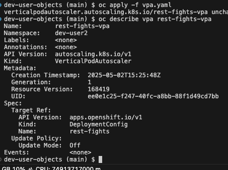
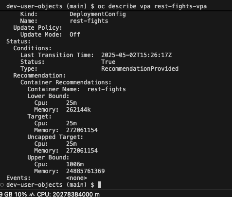
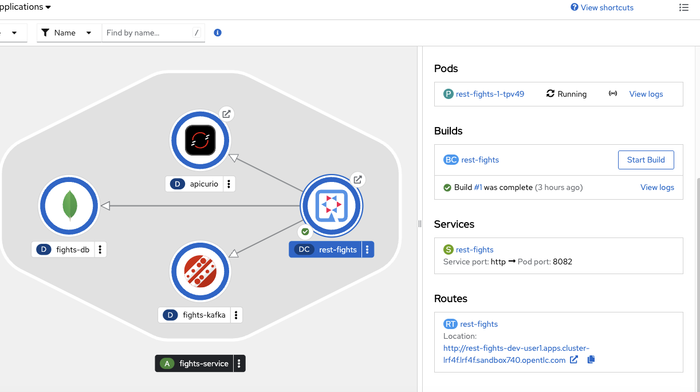
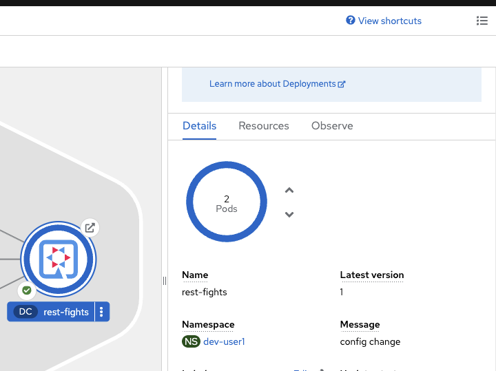

# Accelerate-Dev

## Contents

- [Intro](#intro)
- [Getting started](#getting-started)
- [Vertical Pod Auto Scaler Exercise](#vertical-pod-autoscaler)
- [Pod Budget Distribution Exercise](#pod-budget-distribution-exercise)
- [Horizontal Pod Auto Scaler Exercise](#horizontal-pod-autoscaler-exercise)
- [Network Policy Exercise](#network-policy-exercise)

## Intro

This is an addition to the Accelerate Application Delivery Workshop.
Users will have a chance to try: 
- Vertical Pod AutoScaler - sizing pod baseline resources requirements
- Horizontal Pod AutoScaler - autoscalabity
- Pod Distribution Budget - pod disruption prevention
- Network Policy - restrict access

NOTE: Vertical Auto Scaler requires VPA operator to be installed.

You will be using the openshift project created during the first lab called "dev-userX", where X is a number assigned to you during workshop onboarding ( example: dev-user3 ) 

## Getting Started

Clone this repo: https://github.com/rb16b/Accelerate-Dev

1. You can clone it onto your laptop; however, there may be proxy issues running oc cmds with the cluster on the cloud
2. Clone it into the Dev-Spaces instance provided with the workshop

From the menu, select -> Source Control button

Enter Repo url:

Enter project home: /home/user/

Press the OK button

Press Add to the workspace

Press Trust Provider

Repo Added

## Vertical Pod Autoscaler Exercise

You can use the existing terminal or open a new one 

Make sure you are logged into the cluster. 

If not, login:
$oc login to the cluster with the user ID assigned to you

Use dev-userX project for this exercise

$oc project dev-userX ( example: dev-user5 if your assigned id is user5 )

$ cd /home/user/Accelerate-Dev/dev-user-objects

View the vpa.yaml file first, then apply it to the rest-figths pod in your project ( dev-userX)

$ oc apply -f vpa.yaml 

Check VPA infomration:

Run $ oc describe vpa rest-fights-vpa

VPA doesn't have recommendations at this point

After a while, VPA will provide recommendations, however, those are based on the idle state

Run oc describe vpa rest-fights-vpa

Next, click on the rest-figts pod, on the right of the screen, select Resources. You will find the Route URL on the bottom, open it in the browser, it should look like this (user1 example) - http://rest-fights-dev-user1.apps.cluster-lzxlf.lzxlf.sandbox1417.opentlc.com

Make sure to add q/swagger-ui/ at the end. That will open openAPI screen containing APIs info.

NOTE: You can also find the rest-fights swagger API URL on your workshop main page.

Select Hello API

Run multiple calls to create traffic.

To create more traffic:

Use the script run-load.sh, but first change the URL with a generated URL for this API
"http://RELPLACEME/api/fights/hello" - replace RELPLACEME with an actual API URL

Open the OCP console on Developer perspective, Topology, select project dev-userX

Copy the Route URL from the Resources Tab and apply to run-load.sh script, save the change

Run $ ./run-load.sh 
Use Ctrl-C to stop it

After the script is done :

Check the VPA object and check recommendations.
$oc describe vpa rest-fights-vpa

Look for the recommendation values captured by the VPA for CPU and Memory as shown in the image below

More on the resource estimations : https://github.com/wserafin/resource-estimation

## Pod Budget Distribution Exercise

A Pod Disruption Budget is a Kubernetes resource that specifies the minimum number of pods that must remain available during a disruption caused by voluntary actions (like scaling down) or involuntary actions (like node failures or cluster upgrades)

Make sure you are dev-UserX project.
View the pdb.yaml file to see the configuration.

Since PDB has a min value set to 1, the actual pod has to have a higher number of instances. 
If the number of pods instances configured in the Deployment and PDB are the same, the cluster upgrade would not be able to drain a node with a pod configured like that.

Before applying PDB configuration, we need to set the replica count to 2 for rest-fighys

Run $  oc scale dc/rest-fights --replicas=2

Verify with running oc cmd or check the console  

1. oc cmd $ oc get rc  ( rc stands for replica controller)

NAME            DESIRED   CURRENT   READY   AGE

rest-fights-1   2         2         2       8m21s

2. OCP Console, 

   

Run $ oc apply -f pdb.yaml

You have set up the Pod Distribution Budget for the rest-fights application 

Check if the PDB is ready
$ oc get pdb

You should see the below output -->

NAME         MIN AVAILABLE   MAX UNAVAILABLE   ALLOWED DISRUPTIONS   AGE

fights-pdb   1                  N/A               0                  

NOTE:  On delete pod and pdb 
PDB does not consider explicitly deleting a deployment as a voluntary disruption. !!!
The only way to test it out is to use a node drain command, which requires an admin role.

Set the number of rest-fights pods to 1 

Run $  oc scale dc/rest-fights --replicas=1

## Horizontal Pod AutoScaler Exercise

The Horizontal Pod Autoscaler (HPA) in Kubernetes automatically adjusts the number of pods in a deployment, replication controller, or replica set based on observed metrics, such as CPU utilization or custom metrics.

NOTE: In order to test HPA scalability in action, a load tool ( like JMeter or K6) must generate enough load to trigger scalability.
This exercise will only show HPA impact on a pod's replica number.

Apply HPA to dev-userX (where userX is your workshop userID !!! )project to manage rest-fights pod scalability

First, look at the Developer Console Topology project dev-userX 

Click on the rest-figts pod and Details 

You see the pod count as  1 and arrows for manual pod scalability.

HPA definitions for Min pod count is 2, Max pod count 4.

Run $ oc apply -f hpa.yaml 

Take a look back at the same console

You should notice changes happening, the pod is scaling up

Then, finally, rest-figts is running 2 pods and manual scalability arrows are gone

Delete HPA object:

$oc delete hpa rest-fights-hpa

horizontalpodautoscaler.autoscaling "rest-fights-hpa" deleted

Since HPA increased pod count to 2, scale it down to 1

$  oc scale dc/rest-fights --replicas=1

# Network Policy Exercise

In OpenShift, Network Policies are used to control ingress (incoming) and egress (outgoing) traffic to and from pods. You can create Network Policies to define rules that specify which pods, namespaces, or IP blocks are allowed to connect to your application's pods

View ingress-policy.yaml

Apply Ingress Policy to rest-figts Pod.
 
Run $ oc apply -f ingress-policy.yaml

Run API call from http://YOUR_URL/q/swagger-ui/ and check the return values
Ensure that you update the url to reflect your environment.
 

You should see an error: 503, Service Unavailable 

Delete netowrk policy:

$ oc get networkpolicy

Response: block-ingress   app=rest-fights   44m

$ oc delete networkpolicy block-ingress 

 You can try opening the app URL from the OpenShift console, and the ingress traffic should access the rest-fights app 
