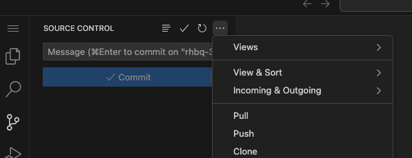
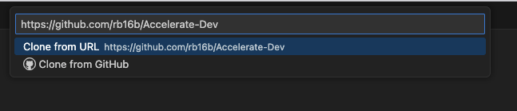
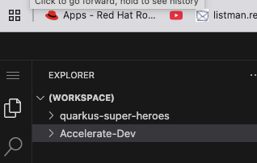
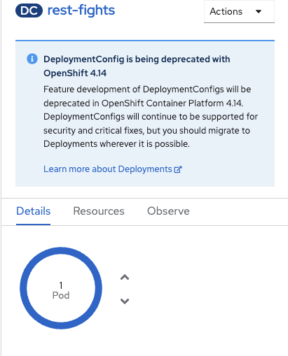
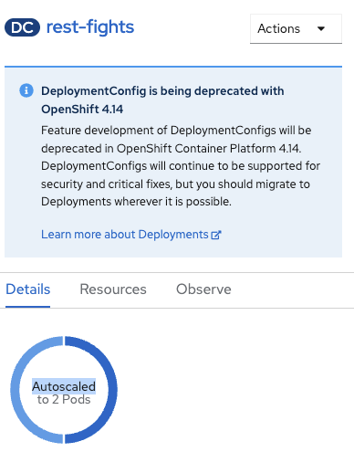
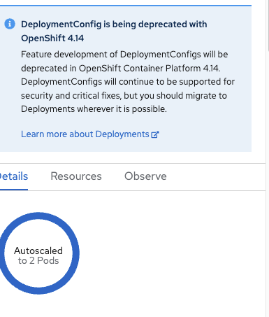
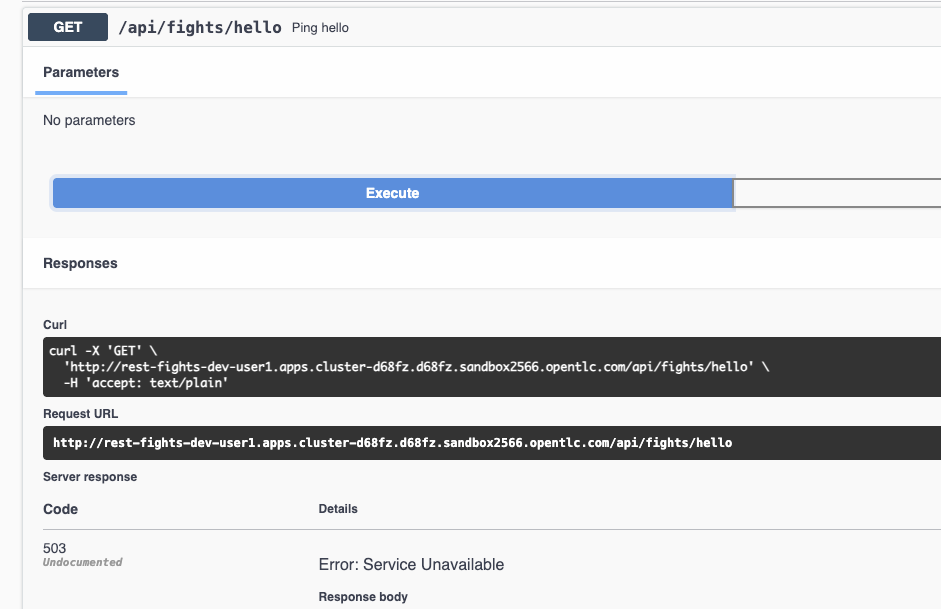

# Accelerate-Dev

## Contents

- [Intro](#intro)
- [Getting started](#getting-started)
- [Pod Budget Distribution Exercise](#components-and-architecture)
- [Horizontal Pod Scaler Exercise](#features-and-known-limitations)
- [Network Policy](#related-links)

## Intro

This is an addition to the Accelerate Application Delivery Workshop.
Users will have a chance to try: 
    - Vertical Pod AutoScaler for assessing Deployment resource levels
    - Horizontal Pod AutoScaler 
    - Pod Distributon Budget
    - Network Policy to restrict access

NOTE: Vertical Auto Scaler requires VPA opertor to be installed, which was done bu the cluster admin.

You will be using the openshift project created during the first lab called dev-userX, where X is a number assigned ( example: dev-user3 ) 

## Getting Started with the Vertical Pod AutoScaler exercise

Clone this repo: https://github.com/rb16b/Accelerate-Dev

1. You can clone it onto your laptop; however, there may be proxy issues running oc cmds with the cluster on cloud
2. Clone it into Dev-Spaces instance provided with the workshop

From the menu select -> Source Control button

Enter Repo url:

Enter project home: /home/user/

Press the OK button

Press Add to the workspace

Press Trust Provider

Repo Added

You can use existing terminal or open a new one 

Make sure you are logged to the cluster 
$oc login to the cluster with the user id assigned to you

Use dev-userX project for this exercise
$oc project dev-userX ( dev-user1 for user1 )

$ cd /home/user/Accelerate-Dev/dev-user-objects

View vpa.yaml file first, then apply it to the rest-figths pod.

$ oc apply -f vpa.yaml 

Next, clik on rest-gightsd pod, on the right of the screen select Resources. you will find the Route url on the botttom, open it in the browser, it should like this - http://rest-fights-dev-user1.apps.cluster-lzxlf.lzxlf.sandbox1417.opentlc.com
Make sure to add q/swagger-ui/ at the end. That will open openAPI screen containing APIs info.

Select Hello API

Run multiple calls to create traffic.

To create more traffic:

Use the script  run-load.sh, but first change the URL with a generated URL for this API
"http://RELPLACEME/api/fights/hello" - replace RELPLACEME with an actual API URL

Run $ ./run-load.sh 
Use cntrl-c to stop it

After the script is done :

Check the VPA object: 
$oc describe vpa rest-fights-vpa

Look for the recommendation values captured by the VPA for CPU and Memory as shown in the image below

## Pod Budget Distribution Exercise

A Pod Disruption Budget is a Kubernetes resource that specifies the minimum number of pods that must remain available during a disruption caused by voluntary actions (like scaling down) or involuntary actions (like node failures or cluster upgrade)

Make sure you are dev-UserX project.
View the pdb.yaml file to see the configuration.

Since pdb has a min value set to 1, the actual pod has to have a higher number of instances.

Before applying PDB configuration we need to set replica count to 2 for rest-figts

Run $ oc apply -f pdb.yaml

You have set up Pod Distribution Budget for the rest-fights application 

Check if pdb is ready
$ oc get pdb

You should see the bellow output -->

NAME         MIN AVAILABLE   MAX UNAVAILABLE   ALLOWED DISRUPTIONS   AGE

fights-pdb   1                  N/A               0                  12m

NOTE: oc delete pod and pdb 
PDB does not consider explicitly deleting a deployment as a voluntary disruption. !!!
The only way to test it out would be to use a node drain command, but that requires an admin role.

## Horizontal Pod Scaler Exercise

The Horizontal Pod Autoscaler (HPA) in Kubernetes automatically adjusts the number of pods in a deployment, replication controller, or replica set based on observed metrics, such as CPU utilization or custom metrics.

Apply HPA to dev-userX (where userX is your workshop userID !!! )project to manage rest-fights pod scalability

Firs,t look at the Developer Console Topology project dev-userX 

Click on the rest-figts pod and Details 

You see the pod count to be 1 and arrows for manual pod scalability.

HPA definitions for Min pod count is 2, Max pod count 4.

Run $ oc apply -f hpa.yaml 

Take a look back at the same console

You should notice changes happing, pod is scaling up

Then finally rest-figts is running 2 pods and manual scalability arrows are gone

# Network Policy Exercise

In OpenShift, Network Policies are used to control ingress (incoming) and egress (outgoing) traffic to and from pods. You can create Network Policies to define rules that specify which pods, namespaces, or IP blocks are allowed to connect to your application's pods

View ingress-policy.yaml

Apply Ingress Policy to rest-figts Pod.
 
Run $ oc apply -f ingress-policy.yaml

Run API call from http://YOUR_URL/q/swagger-ui/ and check the return values
Ensure that you update the url to reflect your environment.
 

You should see an error : 503 , Service Unavailable 

Delete netowrk policy:

$ oc get networkpolcy

Response: block-ingress   app=rest-fights   44m

$ oc delete networkpolicy block-ingress 

 You can try opening the app URL from OpenShift console, and the ingress traffic should access the rest-fights app 
