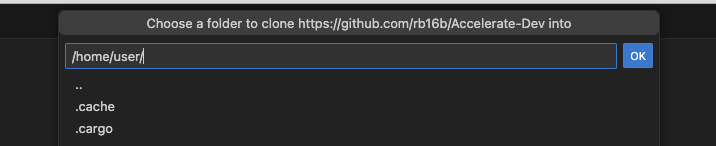

# Accelerate-Dev

## Contents

- [Intro](#intro)
- [Getting started](#getting-started)
- [Vertical Pod Auto Scaler Exercise](#vertical-pod-autoscaler)
- [Pod Budget Distribution Exercise](#pod-budget-distribution-exercise)
- [Horizontal Pod Auto Scaler Exercise](#horizontal-pod-autoscaler-exercise)
- [Network Policy Exercise](#network-policy-exercise)

## Intro

This is an addition to the Accelerate Application Delivery Workshop.
Users will have a chance to try: 
- Vertical Pod AutoScaler - sizing pod baseline resources requirements
- Horizontal Pod AutoScaler - autoscalabity
- Pod Distribution Budget - pod disruption prevention
- Network Policy - restrict access

NOTE: Vertical Auto Scaler requires VPA operator to be installed.

You will be using the openshift project created during the first lab called `dev-userX`, where X is a number assigned to you during workshop onboarding ( example: `dev-user3` ) 

## Getting Started

1. Clone this repo: https://github.com/rb16b/Accelerate-Dev

*  You can clone it onto your laptop; however, there may be proxy issues running oc cmds with the cluster on the cloud
* Clone it into the Dev-Spaces instance provided with the workshop


2. From the left menu, select the  `Source Control` extension


3. Enter Repo url:


4. Enter project home: `/home/user/`



5. Press the `OK` button

6. Press `Add to the workspace`

7. Press `Trust Provider`, Repo is added


## Vertical Pod Autoscaler Exercise

1. You can use the existing terminal or open a new one 

2. Make sure you are logged into the cluster. 

If not, login to the cluster with the user ID assigned to you:
```bash
oc login <URL>
```

3. Use `dev-userX` project for this exercise
 ( example: `dev-user5` if your assigned id is user5 )

```bash
oc project dev-userX
```

4. Navigate to the `dev-user-objects` directory
```bash
 cd /home/user/Accelerate-Dev/dev-user-objects
 ```

5. Open the vpa.yaml file first, then apply it to the rest-fights pod in your project (`dev-userX`)

```bash
oc apply -f vpa.yaml 
```

5. Check the VPA information:

```bash 
oc describe vpa rest-fights-vpa
```

The VPA doesn't have recommendations at this point


After a while, VPA will provide recommendations, however, those are based on the idle state

6. Run the command again

```bash 
oc describe vpa rest-fights-vpa
```


7. Next, from the OpenShift Console, click on the `rest-fights pod`, on the right of the screen, select `Resources`. You will find the `Route` URL on the bottom, open it in the browser, it should look like this (user1 example) - http://rest-fights-dev-user1.apps.cluster-lzxlf.lzxlf.sandbox1417.opentlc.com


Make sure to add `q/swagger-ui/` at the end. That will open openAPI screen containing APIs info.

NOTE: You can also find the `rest-fights` swagger API URL on your workshop main page.


8. Select Hello API

9. Run multiple calls to create traffic.

10. To create more traffic:

Use the script `run-load.sh`, but first change the URL with a generated URL for this API
"http://RELPLACEME/api/fights/hello" - replace RELPLACEME with an actual API URL

11. Reminder: To get the route, open the OCP console on Developer perspective, `Topology`, select project `dev-userX`

12. Copy the Route URL from the Resources Tab and apply to run-load.sh script, save the change

```bash
./run-load.sh 
```
Note: Use Ctrl-C to stop it

13. Once the script is done :

Check the VPA object and check recommendations.
```bash
oc describe vpa rest-fights-vpa
```

Look for the recommendation values captured by the VPA for CPU and Memory as shown in the image below


More on the resource estimations : https://github.com/wserafin/resource-estimation


## Pod Budget Distribution Exercise

A Pod Disruption Budget is a Kubernetes resource that specifies the minimum number of pods that must remain available during a disruption caused by voluntary actions (like scaling down) or involuntary actions (like node failures or cluster upgrades)

Make sure you are `dev-UserX` project.
View the pdb.yaml file to see the configuration.

Since PDB has a min value set to 1, the actual pod has to have a higher number of instances. 
If the number of pods instances configured in the Deployment and PDB are the same, the cluster upgrade would not be able to drain a node with a pod configured like that.

1. Before applying PDB configuration, we need to set the replica count to 2 for rest-fights

```bash
oc scale dc/rest-fights --replicas=2
```

2. Verify with running oc cmd or check the console ( rc stands for replica controller)

```bash
oc get rc
```

```
NAME            DESIRED   CURRENT   READY   AGE
rest-fights-1   2         2         2       8m21s
```

3. Validate in the OCP Console


   

4. Apply the pdb configuration

```bash
oc apply -f pdb.yaml
```

You have set up the Pod Distribution Budget for the rest-fights application 

5. Check if the PDB is ready

```bash
oc get pdb
```

You should see the output below

```bash
NAME         MIN AVAILABLE   MAX UNAVAILABLE   ALLOWED DISRUPTIONS   AGE
fights-pdb   1                  N/A               0                  
```


NOTE:  On delete pod and pdb 
PDB does not consider explicitly deleting a deployment as a voluntary disruption. !!!
The only way to test it out is to use a node drain command, which requires an admin role.

6. Set the number of rest-fights pods to 1 

```bash
oc scale dc/rest-fights --replicas=1
```

## Horizontal Pod AutoScaler Exercise

The Horizontal Pod Autoscaler (HPA) in Kubernetes automatically adjusts the number of pods in a deployment, replication controller, or replica set based on observed metrics, such as CPU utilization or custom metrics.

NOTE: In order to test HPA scalability in action, a load tool ( like JMeter or K6) must generate enough load to trigger scalability.
This exercise will only show HPA impact on a pod's replica number.

Let's Apply the HPA to the `dev-userX` (where userX is your workshop userID !!! ) project to manage rest-fights pod scalability

1. First, look at the `Developer Console` >  `Topology` > project `dev-userX` 

2. Click on the `rest-fights` pod, then `Details` 


You see the pod count as  1 and arrows for manual pod scalability.

3. Apply the HPA configuration. 
The current HPA definitions in the configuration file `hpa.yaml` are mininmum pod count 2, maximum pod count 4.

```bash
oc apply -f hpa.yaml 
```

4. Take a look back at the same console


You should notice changes happening, the pod is scaling up

`rest-fights` is running 2 pods and manual scalability arrows are gone


5. Delete HPA object

```bash
oc delete hpa rest-fights-hpa

horizontalpodautoscaler.autoscaling "rest-fights-hpa" deleted
```

6. Since the HPA increased pod count to 2, scale it down to 1

```bash
oc scale dc/rest-fights --replicas=1
```

# Network Policy Exercise


In OpenShift, Network Policies are used to control ingress (incoming) and egress (outgoing) traffic to and from pods. You can create Network Policies to define rules that specify which pods, namespaces, or IP blocks are allowed to connect to your application's pods

1. View ingress-policy.yaml

2. Apply the Ingress Policy to `rest-fights` Pod.
 
```bash
oc apply -f ingress-policy.yaml
```

3. Execute an API call from `http://YOUR_URL/q/swagger-ui/` and check the return values
Ensure that you update the url to reflect your environment.
 


You should see an error: 503, Service Unavailable 

4. Delete network policy:

```bash
oc get networkpolicy

Response: block-ingress   app=rest-fights   44m
```


```bash
oc delete networkpolicy block-ingress 
```

5. Try opening the app URL from the OpenShift console, and the ingress traffic should access the rest-fights app.
You can also execute an API call from `http://YOUR_URL/q/swagger-ui/` and check the return values.
